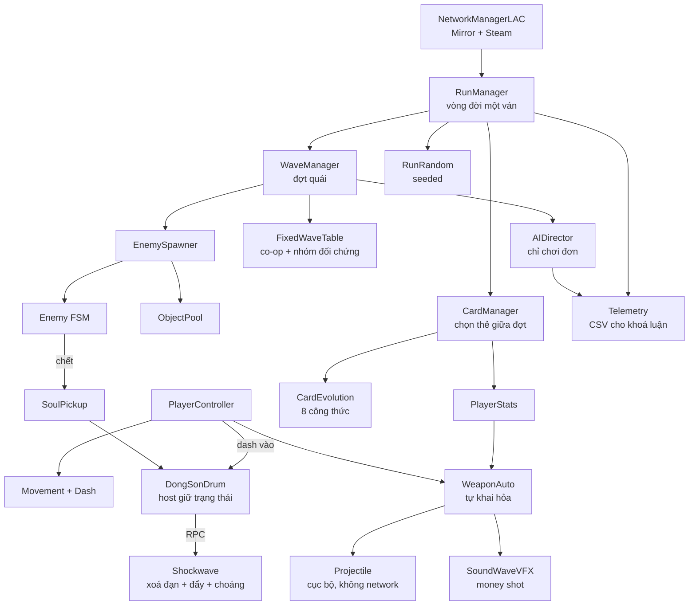

# ARCHITECTURE — Bản đồ hệ thống LẠC

> Đọc [CLAUDE.md](../CLAUDE.md) trước file này.
> File này trả lời: **hệ thống nào tồn tại, chúng gọi nhau thế nào, dữ liệu chảy đi đâu.**

---

## 1. Sơ đồ tổng thể



---

## 2. Các hệ thống, theo thứ tự dựng

### 2.1 `Core/` — nền móng

| Class | Trách nhiệm | Ghi chú |
|---|---|---|
| `RunManager` | Vòng đời một ván: bắt đầu → 16 đợt → thắng/thua. Singleton theo scene | **Chỉ host** điều khiển tiến trình |
| `WaveManager` | Yêu cầu đặc tả đợt, ra lệnh spawn, đếm quái còn sống, kết thúc đợt | Chỉ host |
| `RunRandom` | Bọc `System.Random` với seed của ván. **Nguồn ngẫu nhiên duy nhất trong gameplay** | Seed đồng bộ qua mạng lúc bắt đầu ván |
| `ObjectPool<T>` | Pool chung cho đạn, quái, VFX, số sát thương | Không `Instantiate` trong gameplay |
| `GameEvents` | Event bus tĩnh — `OnEnemyDied`, `OnWaveCleared`, `OnCardPicked`, `OnPlayerHit`… | Giảm tham chiếu chéo giữa các hệ thống |

**Luồng một đợt:**
```
WaveManager.StartWave(n)
  → lấy WaveSpec (AIDirector nếu chơi đơn, FixedWaveTable nếu co-op)
  → EnemySpawner.Spawn(spec, RunRandom)
  → chờ số quái sống == 0
  → GameEvents.OnWaveCleared
  → CardManager.OfferCards(3)
  → chờ cả hai người chơi chọn xong
  → StartWave(n+1)
```

### 2.2 `Player/`

| Class | Trách nhiệm |
|---|---|
| `PlayerController` | Ghép các thành phần, giữ `CharacterData` |
| `PlayerMovement` | Di chuyển 8 hướng, client dự đoán trên nhân vật của mình |
| `PlayerDash` | Dash + i-frame + cooldown. **Cũng là input để kích Trống Đồng** |
| `PlayerHealth` | Máu. **Chỉ host được trừ máu.** Client nhận qua `SyncVar` + RPC hiệu ứng |
| `PlayerStats` | Chỉ số sau khi cộng dồn tất cả thẻ. Vũ khí đọc từ đây |

`CharacterData` (ScriptableObject) chứa: HP gốc, tốc độ, prefab vũ khí, sprite, đặc tính riêng.

### 2.3 `Combat/`

| Class | Trách nhiệm |
|---|---|
| `WeaponAuto` | Bộ đếm chu kỳ, chọn mục tiêu, bắn. Đọc `PlayerStats` |
| `Projectile` | Bay, va chạm, xuyên thấu/nảy. **Không có NetworkIdentity** |
| `DamageSystem` | Điểm vào duy nhất để gây sát thương. **Host-only.** Mọi thứ khác gọi qua đây |
| `Targetable` | Interface cho mọi thứ nhận sát thương |

> **Điểm nghẽn quan trọng:** tất cả sát thương đi qua `DamageSystem.Apply()`. Không class nào được tự trừ máu. Đây là thứ giữ cho co-op không desync.

### 2.4 `Enemies/`

FSM đơn giản, 3 trạng thái: `Spawning` → `Chasing` → `Attacking`. `EnemyData` (SO) chứa HP, tốc độ, sát thương, hành vi, sprite.

Hai máy đều spawn quái từ cùng seed nên chạy song song. Host gửi snapshot vị trí 2 lần/giây để sửa trôi. Chết thì host phát RPC.

### 2.5 `Cards/`

| Class | Trách nhiệm |
|---|---|
| `CardPool` | 32 thẻ nền, lọc theo nhân vật, bốc 3 thẻ bằng `RunRandom` |
| `CardEffect` | Áp hiệu ứng lên `PlayerStats` |
| `CardEvolution` | Kiểm tra 8 công thức sau mỗi lần nhặt thẻ |
| `CardPickUI` | Màn chọn thẻ, 10 giây, 2 lượt đổi |

**Trong co-op:** mỗi người chọn thẻ riêng, nhưng đợt tiếp theo chỉ bắt đầu khi **cả hai** đã chọn xong. Đồng bộ *id thẻ đã chọn*, hai máy tự áp hiệu ứng.

### 2.6 `Drum/` — Trống Đồng

| Class | Trách nhiệm |
|---|---|
| `DongSonDrum` | Object cố định ở tâm đấu trường. Giữ cooldown **dùng chung** — `SyncVar` do host quản |
| `DrumShockwave` | Hiệu ứng: xoá đạn địch, đẩy lùi, choáng 1s |
| `SoulPickup` | Hồn rơi ra, tự hút, nạp cho trống |

**Luồng:** client dash chạm trống → `CmdTryActivate()` → host kiểm tra cooldown → nếu hợp lệ, host thi hành hiệu ứng + `RpcPlayShockwave()` cho VFX ở cả hai máy.

Client **không bao giờ** tự quyết định trống đã sẵn sàng — chỉ hiển thị `SyncVar` mà host gửi.

### 2.7 `Director/` — AI Đạo Diễn

**Chỉ chạy ở chế độ chơi đơn.** Co-op và nhóm đối chứng dùng `FixedWaveTable`.

| Class | Trách nhiệm |
|---|---|
| `AIDirector` | LinUCB contextual bandit |
| `ContextVector` | healthRatio, clearTime, hitsTaken, dashRate, buildType, characterId |
| `WaveSpec` | Đầu ra: số quái, loại, hướng spawn, nhịp |
| `SafetyConstraints` | Chặn các đợt vượt ngưỡng |
| `Telemetry` | Ghi CSV cho phần đánh giá khoá luận |

> **Điều chỉnh so với GDD:** đạo diễn **bất đối xứng**. Khi người chơi đang chật vật, được phép giảm áp lực. Khi người chơi đang mạnh, **không tăng số lượng/máu quái** mà chỉ đổi **thành phần và hướng spawn**. Lý do: siết máu về 15–25% là trừng phạt người chơi vì xây build tốt — nó phá cảm giác sung sướng, thứ bán được game.

> **Đạo diễn phải hiện hình.** HUD hiển thị đạo diễn đang làm gì ("Đạo Diễn: tăng áp lực từ phía Bắc"). Người chơi không thấy thì không ai biết bạn có AI — cả người mua lẫn hội đồng.

### 2.8 `Net/`

Xem [NETCODE.md](NETCODE.md). Tóm tắt: `NetworkManagerLAC`, `SteamLobby`, `NetPlayerSpawner`, `RunSync`.

### 2.9 `VFX/` — money shot

| Class | Trách nhiệm |
|---|---|
| `SoundWaveVFX` | Vòng tròn đồng tâm lan ra, hoa văn Đông Sơn, additive |
| `HitFeedback` | Hit-stop, nháy trắng, đẩy lùi, số sát thương |
| `CameraShake` | Rung màn hình theo cường độ |

**Ràng buộc đọc hiểu:** VFX người chơi = alpha thấp, additive, sorting layer dưới. Đòn địch = màu riêng, vẽ đặc, sorting layer trên cùng. Không bao giờ đảo.

---

## 3. Dữ liệu — ScriptableObject

Mọi con số nằm ở `Assets/_LAC/Data/`, **không** hardcode:

```
Data/
├── Characters/   ThachSanh.asset, Giong.asset, Tam.asset
├── Cards/        32 thẻ nền + 8 tiến hoá
├── Enemies/      CoHon, MaTroi, BuNhin, MaDa, QuyNho, ChanTinh
└── Waves/        FixedWaveTable.asset (co-op + đối chứng)
```

Lý do: artist và designer sửa số trong Inspector mà không đụng code, và không gây conflict git với người đang code.

---

## 4. Scene

| Scene | Nội dung |
|---|---|
| `Boot` | Khởi tạo, vào Menu |
| `Menu` | Menu chính, chọn nhân vật, lobby Steam |
| `Arena` | Đấu trường thi đấu. **Chỉ một scene** cho cả 3 bối cảnh — đổi tilemap + palette, không đổi scene |

> **Cảnh báo git:** file `.unity` là nguồn conflict tệ nhất. Quy tắc: **mỗi lúc chỉ một người được sửa scene.** Mọi thứ khác làm trong prefab. Xem [CONVENTIONS.md](CONVENTIONS.md) mục "Luật scene".

---

## 5. Thứ tự khởi tạo

```
1. NetworkManagerLAC        host bật, client nối
2. RunSync                  đồng bộ seed + nhân vật đã chọn
3. RunManager.StartRun()    host gọi
4. NetPlayerSpawner         spawn 1–2 nhân vật
5. DongSonDrum              đặt ở tâm, cooldown = sẵn sàng
6. WaveManager.StartWave(1)
```

Sai thứ tự này là nguồn bug "client vào ván nhưng không có nhân vật".
