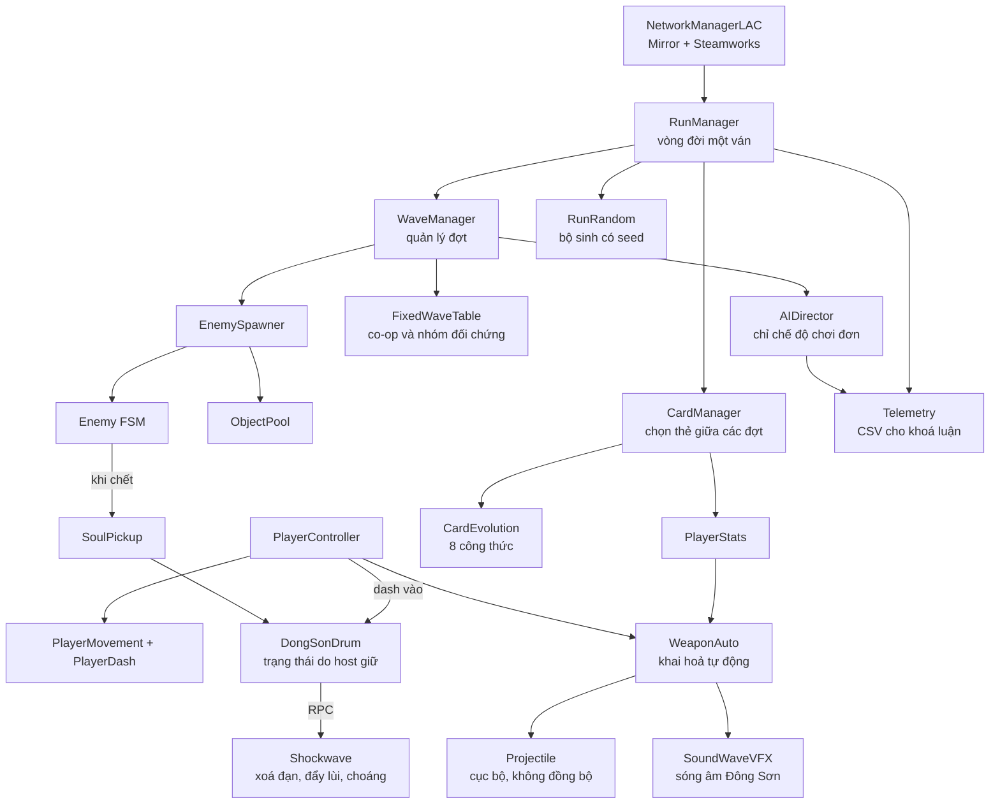

# Kiến trúc hệ thống — LẠC

Tài liệu tham chiếu kỹ thuật. Xác định các module tồn tại trong hệ thống, trách nhiệm của từng module và quan hệ gọi giữa chúng.

Đọc [CLAUDE.md](../CLAUDE.md) trước tài liệu này.

---

## 1. Sơ đồ tổng thể



---

## 2. Đặc tả module

### 2.1 Core — hạ tầng nền tảng

| Lớp | Trách nhiệm | Ghi chú |
|---|---|---|
| `RunManager` | Vòng đời một ván: khởi tạo, điều phối 16 đợt, xác định điều kiện thắng thua | Chỉ host điều khiển tiến trình |
| `WaveManager` | Yêu cầu đặc tả đợt, phát lệnh sinh quái, theo dõi số quái còn sống, kết thúc đợt | Chỉ host |
| `RunRandom` | Bao bọc `System.Random` với seed của ván. **Nguồn ngẫu nhiên duy nhất trong gameplay** | Seed được đồng bộ một lần khi khởi tạo ván |
| `ObjectPool<T>` | Pool dùng chung cho đạn, quái, hiệu ứng, số sát thương | Bắt buộc thay thế cho `Instantiate` trong gameplay |
| `GameEvents` | Event bus tĩnh: `OnEnemyDied`, `OnWaveCleared`, `OnCardPicked`, `OnPlayerHit` | Giảm phụ thuộc chéo giữa các module |

**Trình tự một đợt:**

```
WaveManager.StartWave(n)
  → Lấy WaveSpec (AIDirector nếu chơi đơn, FixedWaveTable nếu co-op)
  → EnemySpawner.Spawn(spec, RunRandom)
  → Chờ số quái còn sống bằng 0
  → GameEvents.OnWaveCleared
  → CardManager.OfferCards(3)
  → Chờ toàn bộ người chơi hoàn tất lựa chọn
  → StartWave(n + 1)
```

### 2.2 Player

| Lớp | Trách nhiệm |
|---|---|
| `PlayerController` | Điều phối các thành phần, giữ tham chiếu `CharacterData` |
| `PlayerMovement` | Di chuyển 8 hướng; client dự đoán cục bộ nhân vật của mình |
| `PlayerDash` | Dash, i-frame, thời gian hồi. Đồng thời là tín hiệu kích hoạt Trống Đồng |
| `PlayerHealth` | Quản lý máu. **Chỉ host được phép thay đổi.** Client nhận qua `SyncVar` và RPC biểu diễn |
| `PlayerStats` | Chỉ số hợp thành sau khi áp toàn bộ thẻ. Vũ khí đọc dữ liệu từ đây |

`CharacterData` (ScriptableObject) chứa: máu gốc, tốc độ, prefab vũ khí, sprite, đặc tính riêng.

### 2.3 Combat

| Lớp | Trách nhiệm |
|---|---|
| `WeaponAuto` | Đếm chu kỳ bắn, chọn mục tiêu, phát đạn. Đọc chỉ số từ `PlayerStats` |
| `Projectile` | Quỹ đạo, va chạm, xuyên thấu và nảy. **Không mang `NetworkIdentity`** |
| `DamageSystem` | Điểm vào duy nhất cho mọi sát thương. Chỉ thực thi trên host |
| `ITargetable` | Interface cho mọi đối tượng có thể nhận sát thương |

> Toàn bộ sát thương đi qua `DamageSystem.Apply()`. Không lớp nào được tự thay đổi máu. Đây là cơ chế bảo đảm tính nhất quán trạng thái trong co-op.

### 2.4 Enemies

Máy trạng thái ba trạng thái: `Spawning` → `Chasing` → `Attacking`. `EnemyData` (ScriptableObject) chứa máu, tốc độ, sát thương, hành vi và sprite.

Hai máy cùng sinh quái từ một seed nên mô phỏng song song. Host gửi snapshot vị trí 2 lần/giây để hiệu chỉnh sai lệch tích luỹ. Sự kiện chết do host phát qua RPC.

### 2.5 Cards

| Lớp | Trách nhiệm |
|---|---|
| `CardPool` | 32 thẻ nền, lọc theo nhân vật, bốc 3 thẻ bằng `RunRandom` |
| `CardEffect` | Áp hiệu ứng lên `PlayerStats` |
| `CardEvolution` | Kiểm tra 8 công thức sau mỗi lần nhận thẻ |
| `CardPickUI` | Giao diện chọn thẻ, giới hạn 10 giây, 2 lượt đổi |

Trong co-op, mỗi người chơi chọn thẻ độc lập nhưng đợt kế tiếp chỉ khởi động khi toàn bộ người chơi hoàn tất. Hệ thống đồng bộ định danh thẻ; mỗi máy tự áp dụng hiệu ứng.

### 2.6 Drum — Trống Đồng

| Lớp | Trách nhiệm |
|---|---|
| `DongSonDrum` | Đối tượng cố định tại tâm đấu trường. Giữ thời gian hồi dùng chung dưới dạng `SyncVar` do host quản lý |
| `DrumShockwave` | Thi hành hiệu ứng: xoá đạn địch, đẩy lùi, gây choáng 1 giây |
| `SoulPickup` | Hồn rơi ra khi quái chết, tự hút về người chơi, nạp năng lượng cho trống |

**Luồng kích hoạt:**

```
Client dash chạm trống
  → CmdTryActivate()
  → Host kiểm tra thời gian hồi
  → Nếu hợp lệ: host thi hành hiệu ứng, phát RpcPlayShockwave() cho phần biểu diễn
```

Client không tự xác định trạng thái sẵn sàng của trống; client chỉ hiển thị giá trị `SyncVar` nhận từ host.

### 2.7 Director — AI Đạo Diễn

Chỉ hoạt động ở chế độ chơi đơn. Chế độ co-op và nhóm đối chứng sử dụng `FixedWaveTable`.

| Lớp | Trách nhiệm |
|---|---|
| `AIDirector` | Thuật toán LinUCB — contextual bandit |
| `ContextVector` | healthRatio, clearTime, hitsTaken, dashRate, buildType, characterId |
| `WaveSpec` | Đầu ra: số lượng quái, chủng loại, hướng sinh, nhịp độ |
| `SafetyConstraints` | Chặn các cấu hình đợt vượt ngưỡng an toàn |
| `Telemetry` | Ghi dữ liệu CSV phục vụ phần đánh giá của khoá luận |

**Hai điều chỉnh so với GDD:**

*Điều tiết bất đối xứng.* Khi người chơi gặp khó, đạo diễn được phép giảm áp lực. Khi người chơi đang mạnh, đạo diễn thay đổi thành phần và hướng sinh quái thay vì tăng số lượng hoặc lượng máu. Cơ sở: siết tổn thất máu về khoảng 15–25% ở cả hai chiều đồng nghĩa với việc trừng phạt người chơi vì xây dựng build hiệu quả, làm triệt tiêu cảm giác tưởng thưởng — yếu tố quyết định giá trị thương mại của thể loại.

*Hiển thị hoạt động của đạo diễn.* HUD thông báo hành vi hiện tại của hệ thống, ví dụ *"Đạo Diễn: tăng áp lực từ hướng Bắc"*. Một hệ thống AI không quan sát được thì không tồn tại đối với người chơi lẫn hội đồng đánh giá.

### 2.8 Net

Xem [CLAUDE.md](../CLAUDE.md) mục 3.2 để biết bảng đồng bộ đầy đủ. Các lớp chính: `NetworkManagerLAC`, `SteamLobby`, `NetPlayerSpawner`, `RunSync`.

### 2.9 VFX

| Lớp | Trách nhiệm |
|---|---|
| `SoundWaveVFX` | Vòng tròn đồng tâm lan toả mang hoa văn Đông Sơn, chế độ additive |
| `HitFeedback` | Hit-stop, nháy trắng, đẩy lùi, số sát thương |
| `CameraShake` | Rung màn hình theo cường độ va chạm |

**Ràng buộc đọc hiểu thị giác:** hiệu ứng của người chơi dùng alpha thấp, chế độ additive, sorting layer thấp. Đòn tấn công của địch vẽ đặc, dùng màu dành riêng, sorting layer cao nhất. Thứ tự này không được đảo ngược trong bất kỳ trường hợp nào.

---

## 3. Dữ liệu cấu hình

Toàn bộ thông số nằm tại `Assets/_LAC/Data/` dưới dạng ScriptableObject. Không hard-code trong C#.

```
Data/
├── Characters/   ThachSanh.asset · Giong.asset · Tam.asset
├── Cards/        32 thẻ nền + 8 thẻ tiến hoá
├── Enemies/      CoHon · MaTroi · BuNhin · MaDa · QuyNho · ChanTinh
└── Waves/        FixedWaveTable.asset — co-op và nhóm đối chứng
```

Cách tổ chức này cho phép điều chỉnh cân bằng qua Inspector mà không chạm vào mã nguồn, đồng thời tránh xung đột với thành viên đang sửa code.

---

## 4. Scene

| Scene | Nội dung |
|---|---|
| `Boot` | Khởi tạo hệ thống, chuyển sang Menu |
| `Menu` | Menu chính, chọn nhân vật, lobby Steam |
| `Arena` | Đấu trường thi đấu |

Cả ba bối cảnh (Sân Đình, Ruộng Lúa, Âm Phủ) dùng chung một scene `Arena`; sự khác biệt được tạo bằng cách thay tilemap và bảng màu, không tạo scene riêng.

> Tệp `.unity` là nguồn xung đột nghiêm trọng nhất trong quản lý phiên bản. Quy định: tại một thời điểm chỉ một thành viên được chỉnh sửa scene; mọi thay đổi khác thực hiện trong prefab. Chi tiết tại [CLAUDE.md](../CLAUDE.md) mục 6.2.

---

## 5. Trình tự khởi tạo

```
1. NetworkManagerLAC      Host khởi động, client kết nối
2. RunSync                Đồng bộ seed và nhân vật đã chọn
3. RunManager.StartRun()   Host phát lệnh
4. NetPlayerSpawner       Sinh 1–2 nhân vật
5. DongSonDrum            Đặt tại tâm đấu trường, trạng thái sẵn sàng
6. WaveManager.StartWave(1)
```

Sai lệch trình tự này là nguyên nhân của lỗi client vào được ván nhưng không có nhân vật.
